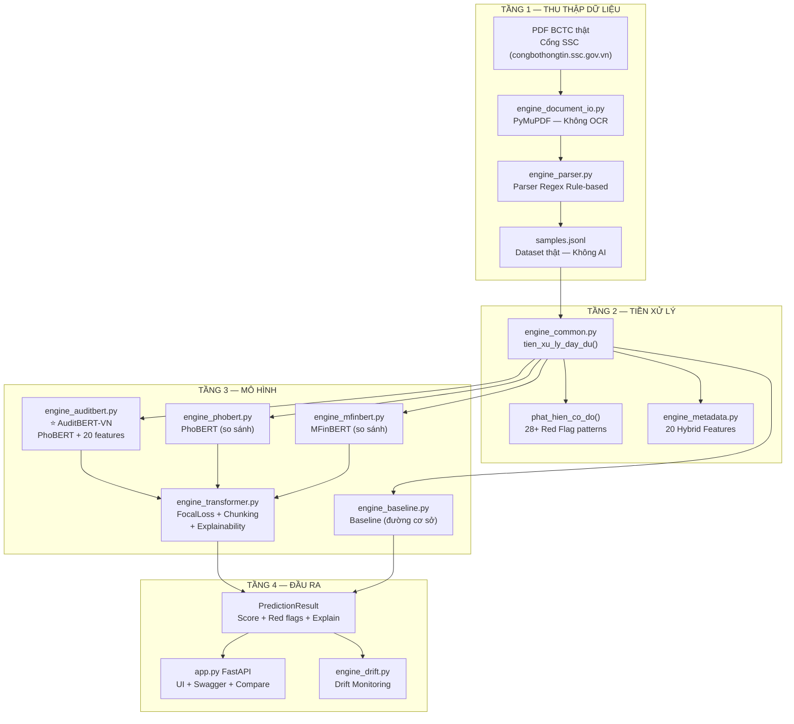

# Giải Thích Code — BaoOngThay

Tài liệu giải thích cấu trúc, luồng xử lý và vai trò từng module trong hệ thống phát hiện gian lận BCTC. Đọc file này trước khi bảo vệ hoặc demo với giảng viên.

---

## 1. Mục tiêu của hệ thống

Hệ thống giải quyết bài toán thực tế:

- **Đầu vào**: Báo cáo Tài chính (BCTC) dạng PDF có Text Layer hoặc TXT
- **Quá trình**: Trích xuất cấu trúc → Tiền xử lý → Feature Fusion → Phân loại
- **Đầu ra**: Xác suất gian lận, mức độ rủi ro, red flags, đoạn nghi ngờ, giải thích

Điểm then chốt phân biệt với các hệ thống khác:
- **Không AI sinh dữ liệu**: Dữ liệu 100% từ BCTC công khai thật
- **Không OCR**: Dùng PyMuPDF đọc Text Layer vật lý thay vì AI scan
- **1 Model Final**: AuditBERT-VN tổng hợp tinh hoa 3 model thành 1 checkpoint nhẹ

---

## 2. Đọc repo theo thứ tự nào

| Thứ tự | File | Vai trò |
|---|---|---|
| 1 | `engine_document_io.py` | Đọc file PDF/TXT — cửa vào dữ liệu |
| 2 | `engine_parser.py` | Parser cấu trúc BCTC — tạo dataset |
| 3 | `engine_common.py` | Nền tảng chung: tiền xử lý, metrics, red flags |
| 4 | `engine_metadata.py` | 20 features Hybrid Metadata cho AuditBERT |
| 5 | `engine_transformer.py` | Lõi train/inference dùng chung |
| 6 | `engine_auditbert.py` | ⭐ AuditBERT-VN — Final Model |
| 7 | `engine_baseline.py` | Baseline TF-IDF + LogReg (đường cơ sở) |
| 8 | `engine_registry.py` | Registry 4 model |
| 9 | `app.py` | FastAPI + UI demo |
| 10 | `train_auditbert.py` | Script train 1 lệnh |

---

## 3. Sơ đồ luồng dữ liệu đầy đủ



---

## 4. Giải thích từng tầng

### Tầng 1 — Thu thập dữ liệu (Không AI)

**engine_document_io.py**
```python
# Đọc PDF bằng PyMuPDF — lấy chữ vật lý từ Text Layer
doc = fitz.open(stream=raw, filetype="pdf")
text = "\n\n".join(page.get_text("layout") or "" for page in doc)

# Nếu PDF là ảnh scan → từ chối (HTTP 400), không OCR
if len(text) < 20:
    raise LoiTrichXuatTaiLieu("PDF là ảnh Scan — OCR đã bị tắt", status_code=400)
```

**engine_parser.py**
- Phát hiện loại file (PDF text layer / TXT)
- Tách sections: Income Statement, Balance Sheet, Cash Flow
- Regex nâng cao xử lý lỗi OCR nhẹ, dấu cách thừa, số tách rời
- Phát hiện cờ đỏ tài chính: lỗ lũy kế, âm vốn chủ, dòng tiền âm

---

### Tầng 2 — Tiền xử lý

**engine_common.py — Các hàm quan trọng nhất**

| Hàm | Mô tả |
|---|---|
| `tien_xu_ly_day_du(text)` | Làm sạch → Chuẩn hóa Unicode → Tách từ TV → Bỏ stopwords |
| `phat_hien_co_do(text)` | 28+ pattern gian lận (hóa đơn giả, doanh thu khống, bên liên quan...) |
| `tim_doan_nghi_ngo(text)` | Cắt các đoạn có mật độ red flag cao nhất để hiển thị |
| `tinh_chat_luong_van_ban(text)` | Ước lượng chất lượng văn bản (0→1) |
| `tim_nguong_toi_uu(labels, scores)` | Quét ngưỡng tối ưu F2 score |
| `tach_chunks_recursive(text)` | Chia văn bản dài thành chunks 768 ký tự có overlap |

**Từ điển tài chính (engine_common.py)**
```python
TU_KHOA_TAI_CHINH_VN = [
    "doanh thu khống", "hóa đơn giả", "khai khống", "gian lận",
    "lỗ lũy kế", "âm vốn chủ", "không trích lập", ...  # 22 mẫu
]
TU_KHOA_TIENG_ANH = {
    "restatement", "misstatement", "overstated", "fictitious",
    "embezzlement", "going-concern", "related", "party", ...  # 40+ từ
}
```

**engine_metadata.py — 20 Hybrid Features**

```python
HYBRID_METADATA_FEATURE_NAMES = [
    # Thống kê căn bản (6 features)
    "log_char_len", "log_token_count", "avg_token_len",
    "ocr_quality", "digit_ratio", "uppercase_ratio", "newline_density",

    # Tín hiệu gian lận rule-based (2 features)
    "red_flag_count", "suspicious_segment_count",

    # Tín hiệu ngôn ngữ (5 features)
    "english_keyword_ratio", "has_related_party",
    "has_invoice_risk", "has_cashflow_risk", "has_off_balance_risk",

    # Feature Fusion mở rộng — AuditBERT (6 features mới)
    "financial_term_density_vn",   # Tín hiệu từ Baseline TF-IDF
    "financial_term_density_en",   # Tín hiệu từ MFinBERT (proxy)
    "round_number_ratio",          # Benford's Law heuristic
    "accounting_code_count",       # Số mã khoản VAS (111, 131, 511...)
    "loss_keyword_count",          # Đếm "lỗ", "âm", "giảm", "thiếu"
    "abnormal_profit_signal",      # Lợi nhuận đột biến bất thường
]
```

---

### Tầng 3 — Mô hình

**engine_auditbert.py — AuditBERT-VN (Final Model)**

```python
class MoHinhGianLanAuditBERT(MoHinhGianLanTransformer):
    """
    Kế thừa TOÀN BỘ engine_transformer.py, chỉ 3 điểm khác:
    1. DISPLAY_NAME = "AuditBERT-VN"  ← tên hiển thị
    2. Backbone = PhoBERT             ← tốt nhất cho tiếng Việt
    3. hybrid_metadata_enabled = True ← BẮT BUỘC BẬT (20 features fusion)
    """
```

**Tại sao AuditBERT nhẹ hơn chạy 3 model?**

Thay vì chạy `PhoBERT.predict() + MFinBERT.predict() + Baseline.predict()` cùng lúc (3x RAM), AuditBERT học các đặc trưng của 3 model ngay trong quá trình **huấn luyện** và lưu vào 1 checkpoint duy nhất. Khi inference chỉ cần load 1 model.

**engine_transformer.py — Lõi dùng chung**

Các kỹ thuật quan trọng:

| Kỹ thuật | Vị trí | Mô tả |
|---|---|---|
| `FocalLoss` | Lớp 66-87 | Giải quyết mất cân bằng class (fraud rất ít) |
| `_train_with_validation()` | Lớp 493-614 | Train với early stopping + best checkpoint |
| `tach_chunks_recursive()` | (engine_common) | Xử lý BCTC nhiều trang vượt max_len |
| `_fit_hybrid_metadata_model()` | Lớp 360-393 | Fit LogisticRegression trên 20 metadata features |
| `_apply_hybrid_vector()` | Lớp 337-348 | Combine raw score + metadata score → final score |
| `explain_all_methods()` | Lớp 732-747 | Integrated Gradients + SHAP + LIME |

---

### Tầng 4 — Đầu ra

**PredictionResult (engine_common.py)**

```python
@dataclass
class PredictionResult:
    label: int                       # 0 = bình thường, 1 = gian lận
    muc_do_rui_ro: str               # "Thấp" / "Trung bình" / "Cao" / "Rất cao"
    model_probability_fraud: float   # Xác suất raw từ backbone transformer
    probability_fraud: float         # Xác suất sau red flags (final score)
    threshold_used: float            # Ngưỡng tối ưu (F2)
    red_flags: list[str]             # Danh sách pattern gian lận phát hiện được
    top_terms: list[str]             # Từ/token ảnh hưởng mạnh nhất
    metadata_features: dict          # 20 hybrid features
    explainability: dict             # IG / SHAP / LIME results
    ...
```

---

## 5. Governance vs Metadata — Không nhầm lẫn

| Thành phần | File | Vai trò | Ảnh hưởng score? |
|---|---|---|---|
| **Governance** | `engine_governance.py` | Kiểm tra dataset TRƯỚC khi train | ❌ Không |
| **Metadata** | `engine_metadata.py` | Feature bổ sung cho mô hình | ✅ Có |

Governance trả lời:
- Dataset có đủ nguồn gốc chưa? (source, doc_id, collected_at)
- Có nhãn chất lượng không? (Cohen's Kappa)
- Tỷ lệ fraud/non-fraud có hợp lý không?
- `ready_for_training = True/False`

Metadata trả lời:
- Văn bản có nhiều số tròn không? (Benford's Law)
- Có nhiều thuật ngữ tài chính rủi ro không?
- Có mã khoản kế toán VAS nào bất thường không?

---

## 6. Bảng so sánh 4 Model

| Tiêu chí | baseline | phobert | mfinbert | **auditbert ⭐** |
|---|---|---|---|---|
| Vai trò | Đường cơ sở | So sánh TV | So sánh tài chính | **Final Model** |
| Backbone | TF-IDF | PhoBERT | MFinBERT | **PhoBERT** |
| Hybrid features | 0 | 14 | 14 | **20** |
| Benford's Law | ❌ | ❌ | ❌ | ✅ |
| VAS Code detection | ❌ | ❌ | ❌ | ✅ |
| MFinBERT signal | ❌ | ❌ | ✅ (gốc) | ✅ (proxy feature) |
| Checkpoint size | ~5MB | ~540MB | ~1GB | **~540MB** |
| Số model cần load | 1 | 1 | 1 | **1** |
| Giải thích được | ✅ | ✅ | ✅ | ✅ |
| Dùng khi nào | Demo nhanh | Đối chứng | Đối chứng | **Kết quả thật** |

---

## 7. Luồng train AuditBERT-VN chi tiết

```
python train_auditbert.py --eval
          |
          ├─ [1] Kiểm tra dataset (samples.jsonl)
          │     └─ In thống kê: tổng mẫu, tỷ lệ fraud/non-fraud
          |
          ├─ [2] Governance check
          │     └─ kiem_tra_governance_dataset() → ready_for_training
          |
          ├─ [3] Train AuditBERT-VN
          │     ├─ Load PhoBERT backbone từ vinai/phobert-base
          │     ├─ Fine-tune với FocalLoss + Early Stopping
          │     ├─ _fit_hybrid_metadata_model() → LogReg trên 20 features
          │     └─ Lưu auditbert_fraud_checkpoint.pt
          |
          └─ [4] Đánh giá trên test set
                └─ F1, F2, AUPRC, MCC, Precision, Recall, Accuracy
```

---

## 8. Luồng inference (dự đoán) khi dùng API

```
POST /analyze-file?model=auditbert (upload file.pdf)
          |
          ├─ engine_document_io.py
          │     └─ PyMuPDF → text (từ chối nếu scan/ảnh)
          |
          ├─ engine_common.py
          │     ├─ tien_xu_ly_day_du() → tokens sạch
          │     ├─ phat_hien_co_do() → red_flags[]
          │     └─ tim_doan_nghi_ngo() → doan_nghi_ngo[]
          |
          ├─ MoHinhGianLanAuditBERT.predict(text)
          │     ├─ (nếu text dài) → tach_chunks_recursive()
          │     ├─ tokenizer PhoBERT → input_ids, attention_mask
          │     ├─ model forward() → raw_fraud_prob (0.XX)
          │     ├─ tao_hybrid_feature_vector() → [1 + 20 features]
          │     ├─ _apply_hybrid_vector() → final_fraud_prob
          │     ├─ adjusted_score = final_prob + 0.05 * len(red_flags)
          │     └─ explain_all_methods() → IG + SHAP + LIME
          |
          └─ PredictionResult → JSON response
```

---

## 9. Câu nói tóm tắt để bảo vệ

> **"Hệ thống BaoOngThay là pipeline phát hiện gian lận BCTC Việt Nam end-to-end. Điểm mới là mô hình AuditBERT-VN — kiến trúc Feature Fusion tích hợp tín hiệu từ 3 nguồn (PhoBERT, Baseline TF-IDF, MFinBERT) vào 1 model duy nhất nhẹ, giải quyết bài toán lệch pha ngôn ngữ đa domain trong tài chính kế toán. Toàn bộ dữ liệu huấn luyện được trích xuất từ BCTC công khai bằng phương pháp rule-based thuần túy — không sử dụng AI để sinh bất kỳ dữ liệu nào."**

---

## 10. Chỗ demo đỉnh nhất với giảng viên

1. Mở `run_demo_ready.cmd` → vào `http://127.0.0.1:8000/`
2. Chọn **AuditBERT-VN** trong dropdown → Upload file BCTC thật
3. Chỉ ra:
   - `extraction_method: "pymupdf_text_layer"` và `ocr_used: false` → "Không AI scan"
   - `red_flags` phát hiện được → "Rule-based 28 patterns"
   - `metadata_features.round_number_ratio` → "Benford's Law"
   - `metadata_features.accounting_code_count` → "Bắt mã khoản VAS"
   - `top_terms` → "Integrated Gradients giải thích quyết định"
4. So sánh tab `baseline` vs `auditbert` → chỉ sự khác biệt score

**Câu hỏi giảng viên hay hỏi + câu trả lời:**

| Câu hỏi | Câu trả lời |
|---|---|
| "Dữ liệu lấy từ đâu?" | "BCTC công khai từ Cổng SSC (https://congbothongtin.ssc.gov.vn/) — engine_parser.py dùng PyMuPDF + Regex trích xuất, không AI" |
| "Tại sao không dùng ChatGPT sinh dữ liệu?" | "Số liệu tài chính AI sinh có thể sai — vi phạm tính liêm chính học thuật và gây drift mô hình" |
| "AuditBERT khác PhoBERT ở đâu?" | "Thêm 6 financial features mới (financial_term_density, Benford's Law, VAS codes) vào Hybrid Head" |
| "Sao không chạy 3 model song song?" | "Quá nặng RAM — Feature Fusion cho phép distill kiến thức 3 model vào 1 checkpoint" |
