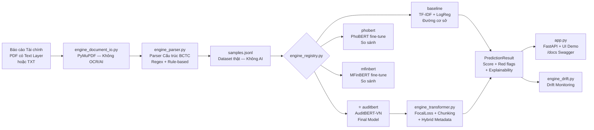

# BaoOngThay — Hệ thống Phát hiện Gian lận Báo cáo Tài chính Việt Nam

Hệ thống phân tích và phát hiện gian lận trên Báo cáo Tài chính (BCTC) tiếng Việt, sử dụng dữ liệu công khai từ HOSE, HNX và các cơ quan Nhà nước. Toàn bộ quy trình **không sử dụng AI để sinh dữ liệu huấn luyện** — đảm bảo tính liêm chính học thuật và thực tiễn nghiên cứu.

---

## 1. Mô hình Final — AuditBERT-VN

**AuditBERT-VN** là mô hình tổng hợp cuối cùng của dự án, tích hợp tinh hoa của 3 model thành **1 model duy nhất** — nhẹ, nhanh, không cần chạy song song:

```
┌──────────────────────────────────────────────────────┐
│               AuditBERT-VN Architecture              │
│                                                      │
│  Backbone: PhoBERT (vinai/phobert-base)              │
│      ↳ Hiểu sâu ngữ pháp & văn phong tiếng Việt     │
│                                                      │
│  + Hybrid Metadata Head (20 features):               │
│    ├─ [Baseline signal]  TF-IDF fraud keywords       │
│    │   financial_term_density_vn, round_number_ratio  │
│    ├─ [MFinBERT signal]  English financial terms     │
│    │   financial_term_density_en                      │
│    └─ [Rule-based]  Red flags + VAS accounting codes │
│        red_flag_count, accounting_code_count, ...    │
│                                                      │
│  → 1 Checkpoint duy nhất (~540MB)                   │
│  → Không load PhoBERT + MFinBERT + Baseline cùng lúc│
└──────────────────────────────────────────────────────┘
```

Các model `baseline`, `phobert`, `mfinbert` vẫn có sẵn để **so sánh nghiên cứu**.

---

## 2. Kiến trúc hệ thống



---

## 3. Cấu trúc file

```text
app.py                    FastAPI + UI demo tại "/"
main.py                   CLI train / eval / prepare checkpoint
train_auditbert.py        ⭐ Script train AuditBERT-VN (1 lệnh)
engine_auditbert.py       ⭐ AuditBERT-VN model class (Final Model)
engine_registry.py        Registry 4 model: auditbert / baseline / phobert / mfinbert
engine_common.py          Tiền xử lý, DataSplit, PredictionResult, red flags, từ điển tài chính
engine_document_io.py     Đọc PDF (PyMuPDF — không OCR) + TXT
engine_parser.py          Parser cấu trúc BCTC thật (Regex rule-based)
engine_governance.py      Kiểm tra governance dataset trước khi train
engine_metadata.py        20 features Hybrid Metadata (Feature Fusion cho AuditBERT)
engine_baseline.py        Baseline: TF-IDF + Logistic Regression
engine_transformer.py     Core dùng chung: train/inference/explainability/hybrid metadata
engine_phobert.py         Wrapper PhoBERT (so sánh)
engine_mfinbert.py        Wrapper MFinBERT (so sánh)
engine_explainability.py  Integrated Gradients / SHAP / LIME
engine_drift.py           Drift monitoring khi dùng thực tế
engine_tuning.py          Hyperparameter tuning bằng Optuna
samples.jsonl             ⭐ Dataset chính (từ BCTC thật — không AI sinh)
```

Checkpoint:
```text
auditbert_fraud_checkpoint.pt          ⭐ Final Model (sinh từ train_auditbert.py)
baseline_fraud_checkpoint.pkl          Baseline (đường cơ sở)
phobert_fraud_checkpoint.pt            PhoBERT (so sánh)
mfinbert_fraud_checkpoint.pt           MFinBERT (so sánh)
```

---

## 4. Dataset — Tiêu chuẩn "Không AI tạo dữ liệu"

### 4.1. Nguyên tắc cốt lõi

Dự án tuân thủ **tuyệt đối** nguyên tắc: không dùng AI (ChatGPT, Claude,...) để sinh câu/số liệu trong dataset huấn luyện. Toàn bộ dữ liệu lấy từ BCTC thật, công khai.

| Tiêu chí | Trạng thái |
|---|---|
| Nguồn dữ liệu công khai (HOSE/HNX/Bộ Tài chính) | ✅ |
| Không OCR bằng AI (tắt Tesseract/pdf2image) | ✅ |
| Đọc PDF bằng PyMuPDF (Text Layer vật lý) | ✅ |
| Từ chối PDF scan tại API (HTTP 400) | ✅ |
| Không dùng LLM để sinh câu mẫu | ✅ |

### 4.2. Pipeline tạo Dataset

```
1. Tải PDF BCTC thật (HOSE/HNX/cổng công bố Nhà nước)
      ↓
2. engine_document_io.py → PyMuPDF bóc chữ từ Text Layer
      ↓
3. engine_parser.py → Regex trích xuất bảng số (Doanh thu, Lợi nhuận, v.v.)
      ↓
4. samples.jsonl → {"text": "...", "label": 0/1}
      ↓
5. train_auditbert.py → AuditBERT-VN checkpoint
```

### 4.3. Format Dataset

```jsonl
{"text": "Doanh thu thuần 2023: 1.250 tỷ đồng, giảm 32% so với 2022...", "label": 1}
{"text": "Báo cáo được lập trên cơ sở hoạt động liên tục theo chuẩn VAS...", "label": 0}
```

- `label = 1`: Có dấu hiệu gian lận / rủi ro cao
- `label = 0`: Bình thường

---

## 5. Cài đặt

```bash
# Cài thư viện cơ bản
pip install -r requirements-web.txt

# Cài PyMuPDF (đọc PDF không OCR)
pip install pymupdf

# Cài PyTorch + Transformers cho AuditBERT/PhoBERT/MFinBERT
pip install torch transformers sentencepiece

# Tuỳ chọn: Explainability
pip install captum

# Tuỳ chọn: Hyperparameter tuning
pip install optuna
```

> **Lưu ý:** Dự án **không cần** cài `pytesseract`, `pdf2image`, `poppler`.  
> OCR đã bị gỡ bỏ hoàn toàn theo nguyên tắc "Không AI scan data".

---

## 6. Cách chạy

### 6.1. Tạo Dataset từ PDF thật

```bash
# Đặt các file PDF BCTC vào thư mục, ví dụ: C:\bctc\
python engine_parser.py --folder "C:\bctc" --output samples.jsonl
```

### 6.2. Train AuditBERT-VN (Final Model)

```bash
# Train từ samples.jsonl
python train_auditbert.py

# Train + đánh giá trên test set
python train_auditbert.py --eval

# Train nhanh để demo (dùng mini_samples)
python train_auditbert.py --quick
```

### 6.3. Chạy FastAPI Server

```bash
uvicorn app:app --reload --port 8000
```

Truy cập:
- `http://127.0.0.1:8000/` — Giao diện Upload file
- `http://127.0.0.1:8000/docs` — Swagger UI
- `http://127.0.0.1:8000/health` — Trạng thái server

### 6.4. Train model đường cơ sở (so sánh)

```bash
python main.py --prepare-api --model baseline
python main.py --prepare-api --model phobert
python main.py --prepare-api --model mfinbert
```

### 6.5. Phân tích CLI

```bash
python main.py --model auditbert --text "Doanh thu tăng mạnh nhưng dòng tiền âm"
python main.py --model auditbert --file bao_cao.pdf
python main.py --model auditbert --folder "C:\bctc"
```

### 6.6. Demo nhanh

```bat
run_demo_ready.cmd
```

---

## 7. API Endpoints

| Endpoint | Method | Mô tả |
|---|---|---|
| `/analyze-text` | POST | Phân tích text trực tiếp |
| `/analyze-file` | POST | Upload `.txt` hoặc `.pdf` |
| `/analyze-pdf` | POST | Upload `.pdf` |
| `/analyze-path` | POST | Phân tích file theo đường dẫn |
| `/compare-text` | POST | So sánh 4 model trên cùng 1 text |
| `/compare-file` | POST | So sánh 4 model trên cùng 1 file |
| `/health` | GET | Trạng thái, checkpoint, drift |
| `/login` | POST | Xác thực demo |
| `/drift/status` | GET | Thống kê drift |

**Chọn model qua query parameter:**
```
POST /analyze-file?model=auditbert   ← ⭐ Final Model
POST /analyze-file?model=baseline    ← Đường cơ sở
POST /analyze-file?model=phobert     ← So sánh
POST /analyze-file?model=mfinbert    ← So sánh
```

---

## 8. Output điển hình

```json
{
  "model": "AuditBERT-VN",
  "label": 1,
  "fraud_probability": 0.847,
  "risk_level": "Cao",
  "threshold_used": 0.45,
  "red_flags": ["dòng tiền âm", "giao dịch bên liên quan"],
  "top_terms": ["doanh thu khống", "hóa đơn", "trích lập thiếu"],
  "metadata_features": {
    "financial_term_density_vn": 0.032,
    "financial_term_density_en": 0.015,
    "round_number_ratio": 0.67,
    "accounting_code_count": 12,
    "red_flag_count": 3
  },
  "source_type": "pdf",
  "extraction_method": "pymupdf_text_layer",
  "ocr_used": false
}
```

---

## 9. Bảng so sánh Model

| Tiêu chí | baseline | phobert | mfinbert | **auditbert** |
|---|---|---|---|---|
| Vai trò | Đường cơ sở | So sánh | So sánh | **⭐ Final Model** |
| Backbone | TF-IDF | PhoBERT | MFinBERT | **PhoBERT** |
| Hybrid Metadata | Không | 14 features | 14 features | **20 features** |
| Signal tài chính Baseline | ✅ | Một phần | Một phần | **✅ Đầy đủ** |
| Signal MFinBERT | Không | Không | ✅ | **✅ Proxy feature** |
| Tốc độ inference | Nhanh nhất | Chậm | Chậm | **Chậm (1 model)** |
| Số checkpoint cần load | 1 | 1 | 1 | **1** |
| Giải thích | top_terms | IG + SHAP + LIME | IG + SHAP + LIME | **IG + SHAP + LIME** |
| Phù hợp bảo vệ | Đối chứng | So sánh | So sánh | **Kết quả chính** |

---

## 10. Tài liệu liên quan

- [GIAI_THICH_CODE.md](GIAI_THICH_CODE.md) — Giải thích chi tiết từng module
- [PhoBERT paper](https://aclanthology.org/2020.findings-emnlp.92/)
- [MFinBERT (sonnv/MFinBERT)](https://huggingface.co/sonnv/MFinBERT)
- [Focal Loss](https://arxiv.org/abs/1708.02002)
- [PyMuPDF Financial Parser — arXiv:2410.09871v2](https://arxiv.org/abs/2410.09871)

---

## 11. Tóm tắt đóng góp học thuật

> Dự án đề xuất kiến trúc **AuditBERT-VN** — mô hình phát hiện gian lận BCTC tiếng Việt tổng hợp đầu tiên sử dụng **Feature Fusion** từ 3 nguồn tín hiệu (PhoBERT, Baseline TF-IDF, MFinBERT proxy) vào **1 model duy nhất nhẹ**. Toàn bộ dữ liệu huấn luyện được trích xuất từ BCTC công khai bằng phương pháp rule-based (PyMuPDF + Regex), **không sử dụng AI để sinh bất kỳ dữ liệu nào**, đảm bảo tính liêm chính và khả năng tái sản xuất trong nghiên cứu.
